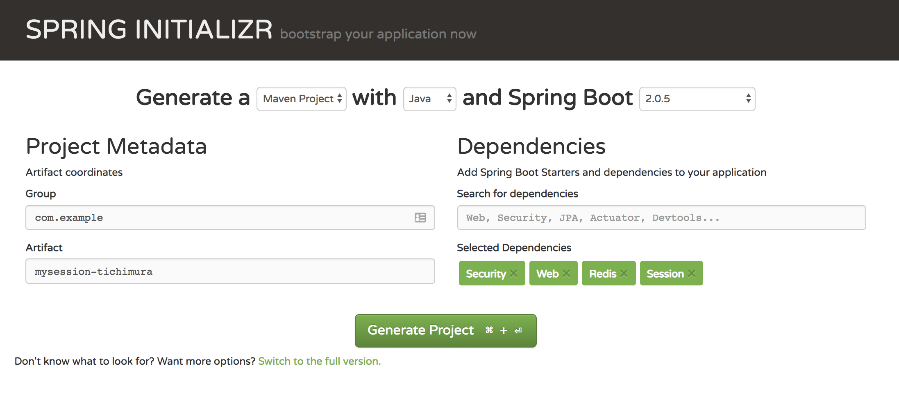

## Springとセッション管理 (Spring Session + Spring Security)

## 1. 事前設定

- maven
- eclipse/spring tool suite
- redis-cliコマンド
- pcfアカウント
- docker, もしくはpwsアカウント

## 2. プロジェクトの作成

- start.spring.ioから作成

  Security, Web, Redisを選択


## 3. コードの編集

- pom.xmlの確認

``` xml

  <dependency>
    <groupId>org.springframework.boot</groupId>
    <artifactId>spring-boot-starter-security</artifactId>
  </dependency>
  <dependency>
    <groupId>org.springframework.boot</groupId>
    <artifactId>spring-boot-starter-web</artifactId>
  </dependency>

  <dependency>
    <groupId>org.springframework.boot</groupId>
    <artifactId>spring-boot-starter-data-redis</artifactId>
  </dependency>		
  <dependency>
    <groupId>org.springframework.session</groupId>
    <artifactId>spring-session-data-redis</artifactId>
  </dependency>

  <dependency>
    <groupId>org.springframework.boot</groupId>
    <artifactId>spring-boot-starter-test</artifactId>
    <scope>test</scope>
  </dependency>
  <dependency>
    <groupId>org.springframework.security</groupId>
    <artifactId>spring-security-test</artifactId>
    <scope>test</scope>
  </dependency>

```

**Note**

> `spring-boot-starter-data-redis`により、Spring Bootから`RedisConnectionFactory`が自動的に作成される.  
なお、Redis Clientとしては`lettuce`(Java Redis client)が使われる

https://github.com/lettuce-io/lettuce-core/

- application.properties

``` yaml

spring.session.store-type=redis
spring.redis.host=localhost # Dockerの場合
# spring.redis.host=192.168.99.100 # Dockerの場合
spring.redis.port=6379
spring.session.redis.flush-mode=on-save
spring.session.redis.namespace=spring:session

```

**Note**
> `spring.session.store-type=redis`は`@EnableRedisHttpSession`に相当.これによりHttpSessionをRedisに格納する`springSessionRepositoryFilter`というFilterが作成される

> `springSessionRepositoryFilter`というFilterを起動させるのに、@Configurationを実装したConfigクラスが必要
> ServletContainerにこのFilterを渡す部分も、Spring Bootが担当

 > Spring Bootが`RedisConnectionFactory`を作成するので、デフォルト値を明示的に指定するため、関連するプロパティ`spring.redis.host`, `spring.redis.port`, (オプションで)`spring.redis.password`を指定する


- Controller(RestController)クラスの作成

``` java

@RestController
public class SessionRestController {

  // サンプルのため、encodeしたセッションIDも表示させてます

	@GetMapping("/")
	String uid(HttpSession session) {

		String encoded = Base64.getEncoder()
                .encodeToString(session.getId().getBytes());

		return "base64 encoding is " + encoded + "<br /> session-id is " + session.getId();

	}
}

```

- Configurationクラス

``` java
@Configuration
@EnableWebSecurity
public class SessionConfig extends WebSecurityConfigurerAdapter {


　// PasswordEncoder(org.springframework.security.crypto.password.PasswordEncoder)の実装(テスト用)
	@Bean
	public static NoOpPasswordEncoder passwordEncoder() {
	    return (NoOpPasswordEncoder) NoOpPasswordEncoder.getInstance();
	}

  // リクエスト処理
	@Override
	protected void configure(HttpSecurity http) throws Exception {
	        http.authorizeRequests().antMatchers("/**").hasRole("USER").and().formLogin();
	}

  // パスワードのチェック
	@Autowired
	protected void configure(AuthenticationManagerBuilder auth) throws Exception {
	        auth.inMemoryAuthentication().withUser("user").password("password").roles("USER");
	}

}
```


## 4. スタンドアロンでの実行

- Redisの立ち上げ

  - Dockerの場合
  ```
  docker run --name redis -d -p 6379:6379 redis redis-server --appendonly yes
  ```
  (docker-machineを利用する場合は),　IPアドレスは、eval $(docker-machine env)より取得

  - プロセスの場合

    - Homebrew
    ```
    brew install redis
    ```

    - Windows
    https://github.com/MicrosoftArchive/redis/releases

- Spring Bootとして起動

  `` "Boot Dashboard" -> プロジェクト名 -> "(Re)Start" あるいは "実行" ``

- IDEから起動

  プロジェクト名で右クリック -> "Run As" -> "Maven build"
  `Base Directory: ${project_loc:プロジェクト名}`  
  `Goals: clean spring-boot:run`  

- mvnとしてCLIから起動

  ` ./mvnw clean spring-boot:run `

- ブラウザで確認

**Note:** Chromeを想定

  - `localhost:8080`にアクセス
  - 画面上で、右クリック
  - inspectを選択

  

  - Cookieの情報を確認


  **Note**
  > Spring SessionがHttpSessionを書き換えて、Spring Securityの`SecurityContextPersistenceFilter`による SecurityContextをHttpSessionに格納、その後, Redisに格納される
  >  Spring Session は `SESSION` というクッキーを作成し、その中に、session idを含む(Spring Boot 2からはbase64エンコードされているので注意)  


## 5. PCF(PWS)での実行

- application-cloud.propertiesの編集
``` yaml
spring.session.store-type=redis
spring.redis.host=${vcap.services.myredisdemo.credentials.hostname}
spring.redis.password=${vcap.services.myredisdemo.credentials.password}
spring.redis.port=${vcap.services.myredisdemo.credentials.port}
spring.session.redis.flush-mode=on-save
spring.session.redis.namespace=spring:session
```

- buildの実行

``` bash
./mvnw clean package -DskipTests=true
```

- (あるいは)IDEでの実行

  プロジェクト名で右クリック -> "Run As" -> "Maven build"
  `Base Directory: ${project_loc:プロジェクト名}`  
  `Goals: clean package -DskipTests=true`  


- サービスの作成
``` bash
# redisサービスの確認(pcfなら、p-redis, pwsならrediscloud)
cf m
# redisサービスの作成
cf create-service myredis-<ユーザ名> サービス名 プラン名
```

- manifest.ymlの作成  
  ``` yaml
  applications:
  - name: springsecurity-demo
    path: ./target/securitydemo-0.0.1-SNAPSHOT.jar
    services:
      - myredis-<ユーザ名>
  ```

- cf push
``` bash
cf push springsecurity-demo-ユーザ名 -f manifest.yml
```

  - IDEの場合

    - Boot Dashboard
    - プロジェクト名を右クリック
    - Deploy and Run ONから、ターゲットとなるPCF環境を選択
    - manifestの内容を確認して、OKをクリック
    


- ブラウザで確認

  {}
  Chromeを想定
  {}

  - pushした後に表示されるURLにアクセス
  - 画面上で、右クリック
  - inspectを選択

  

  - Cookieの情報を確認

## 6. アプリの確認

- 作成されたアプリにアクセス
ログイン後、セッションが表示されるか確認、タブを変えても同じセッション情報が表示されることを確認
また、cookieを消去すると新しいログイン画面とセッションIDが生成されることを確認

- Redisに保存されているKEYの確認
``` bash
redis-cli -h ホスト名 -p ポート名 -a パスワード
:PORT> keys *
1) "spring:session:expirations:1539507420000"
2) "spring:session:sessions:75daf9e6-221e-4213-bba2-8001a3d2dad4"
3) "spring:session:sessions:expires:75daf9e6-221e-4213-bba2-8001a3d2dad4"
4) "spring:session:index:org.springframework.session.FindByIndexNameSessionRepository.PRINCIPAL_NAME_INDEX_NAME:admin"
5) "spring:session:expirations:1539507060000"
```

- Redisに保存されているKEYの削除
```
192.168.99.100:6379> del spring:session:sessions:84dc7645-0d94-4838-ab34-89a0fd06ee9c
(integer) 1
192.168.99.100:6379>
```

## 7. 参考情報

- Spring Session - Spring Boot  
 https://docs.spring.io/spring-session/docs/current/reference/html5/guides/boot-redis.html#boot-sample

- Code
  https://github.com/spring-projects/spring-session/tree/2.0.6.RELEASE/samples/boot/redis

- Spring Boot and Redis
  https://docs.spring.io/spring-boot/docs/2.1.0.M3/reference/htmlsingle/#boot-features-connecting-to-redis
